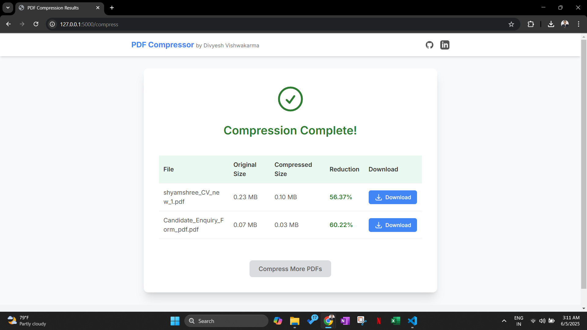

# 🚀 PDF Compressor (Flask, PyMuPDF, PikePDF, Ghostscript)

**High-Quality Open Source Batch PDF Compressor**  
Modern, privacy-respecting, and built for both end-users & developers by [Divyesh Vishwakarma](https://github.com/divyesh1099)  
[](https://github.com/divyesh1099)
[](https://www.linkedin.com/in/motidivya/)

---

## 🌟 Features

- **Best-in-class PDF compression** (multi-layered, lossless/lossy as needed)
- **Batch compress multiple PDFs** at once (UI & backend)
- **Aggressive image recompression** (PyMuPDF) – JPEGs optimized per user quality
- **Stream/object deduplication and linearization** (pikepdf/qpdf)
- **Maximal vector/font/structure optimization** (Ghostscript, industry standard)
- **No cloud upload, 100% on-prem/local privacy**
- **Beautiful, modern UI** with file listing, size breakdown, and easy download
- **Fully open source, MIT licensed**

---

## ⚡ Demo

> _Deploy locally and open [http://localhost:5000](http://localhost:5000) in your browser!_  
> _Sample screenshot:_  
> 

---

## 🛠️ Tech Stack

- **Backend:** Python 3, Flask
- **Image Recompression:** [PyMuPDF](https://pymupdf.readthedocs.io/en/latest/)
- **PDF Optimization:** [pikepdf](https://pikepdf.readthedocs.io/en/latest/) (qpdf under the hood)
- **Advanced Compression:** [Ghostscript](https://www.ghostscript.com/)
- **Frontend:** HTML5, CSS3, JS, [Material Icons](https://fonts.google.com/icons)
- **Batch Uploads:** Native HTML5 + Flask multi-file POST

---

## 🚀 Quickstart

### 1. **Clone the Repo**

```sh
git clone https://github.com/divyesh1099/compressPDF.git
cd compressPDF
````

### 2. **Install Python Dependencies**

It is recommended to use a **virtual environment**.

```sh
python -m venv venv
source venv/bin/activate  # On Windows: venv\Scripts\activate
pip install -r requirements.txt
```

`requirements.txt` contains:

```
Flask
PyMuPDF
pikepdf
```

### 3. **Install Ghostscript**

* **Linux/macOS:**

  * `sudo apt install ghostscript`
  * or `brew install ghostscript`
* **Windows:**

  * [Download Ghostscript](https://ghostscript.com/download/gsdnld.html) and add the install directory (containing `gswin64c.exe`) to your **PATH**.

### 4. **Run the App**

```sh
python app.py
```

Now open [http://localhost:5000](http://localhost:5000) in your browser.

---

## 🎨 Usage (Web)

1. **Visit the site** and select one or more PDF files.
2. **(Optional):** Adjust JPEG image quality (10–100) for best compression/quality tradeoff.
3. Click **Compress PDFs**.
4. Wait for processing – results (original/optimized size, percent reduction) are shown per file.
5. Download the compressed PDFs with a single click.

---

## 🏗️ Architecture & Compression Pipeline

**Each PDF is processed as follows:**

1. **Image Optimization (PyMuPDF):**

   * All grayscale/RGB images are re-encoded as JPEG at your desired quality if that makes them smaller.
2. **Stream & Structure Optimization (pikepdf):**

   * Deduplicate, compress, and object-stream all PDF internal data.
3. **Maximal Compression (Ghostscript):**

   * Downsamples vectors, fonts, and further linearizes and compresses the entire PDF.

> **Temp files are automatically cleaned. Batch uploads are supported out-of-the-box.**

---

## ⚙️ Configuration

* **Compression Quality:**
  The default is `75` (good for most cases).
  Lower = smaller PDF, higher = better image quality.

* **Ghostscript Quality Presets:**

  * `/screen` – 72dpi, smallest, low-res
  * `/ebook` – 150dpi, perfect for sharing/archival (default)
  * `/printer` – 300dpi, best for print

  (You can add more or change defaults in the Python code.)

* **Output Directory:**
  All compressed files are saved in `compressed/`, which is **cleared before each batch**.

---

## 🚩 Deployment

* **For development:**
  `python app.py` (runs on `localhost:5000`)

* **For production:**
  Use a WSGI server (e.g., Gunicorn, Waitress) and a reverse proxy (nginx, etc).

  ```
  gunicorn -w 4 app:app
  ```

---

## 🐞 Troubleshooting

* **Ghostscript not found?**

  * Make sure it's installed and on your `PATH` (`gswin64c.exe` for Windows, `gs` for Linux/macOS).
* **"Compression failed" errors:**

  * Check the console for details – usually a corrupt or non-PDF file.
* **Large PDFs or memory errors:**

  * Consider increasing system RAM or compressing in smaller batches.

---

## 💡 Customization

* **Branding & UI:**
  Tweak `index.html` and `success.html` for your own style, colors, and footer info.
* **Support more filetypes:**
  Extend the allowed files/extensions in the Python code if needed.
* **Add authentication, analytics, Sentry, etc.:**
  Standard Flask best-practices apply.

---

## 🤝 Credits

Created and maintained by [Divyesh Vishwakarma](https://github.com/divyesh1099)

* [GitHub: divyesh1099](https://github.com/divyesh1099)
* [LinkedIn: motidivya](https://www.linkedin.com/in/motidivya/)

PDF compression pipeline inspired by the best of the open-source Python/PDF community.
Uses PyMuPDF, PikePDF, Ghostscript, and Flask.

---

## 📜 License

MIT License – free for commercial and personal use.
*Attribution appreciated but not required. Star ⭐️ the repo if you found it useful!*

---

**Happy compressing!**
*For professional projects, consulting, or dev work, [contact me on LinkedIn](https://www.linkedin.com/in/motidivya/).*

❤️Moti